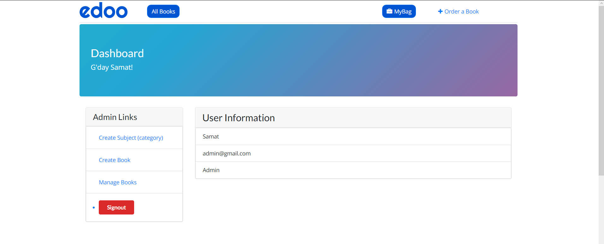
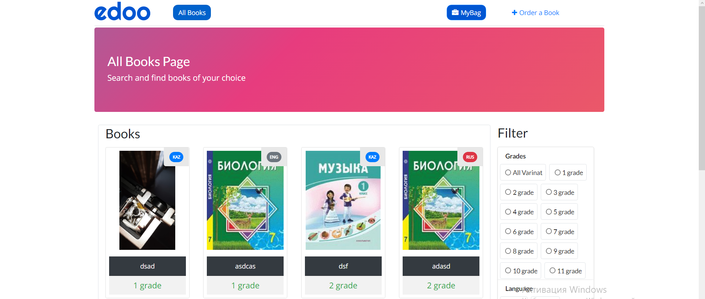
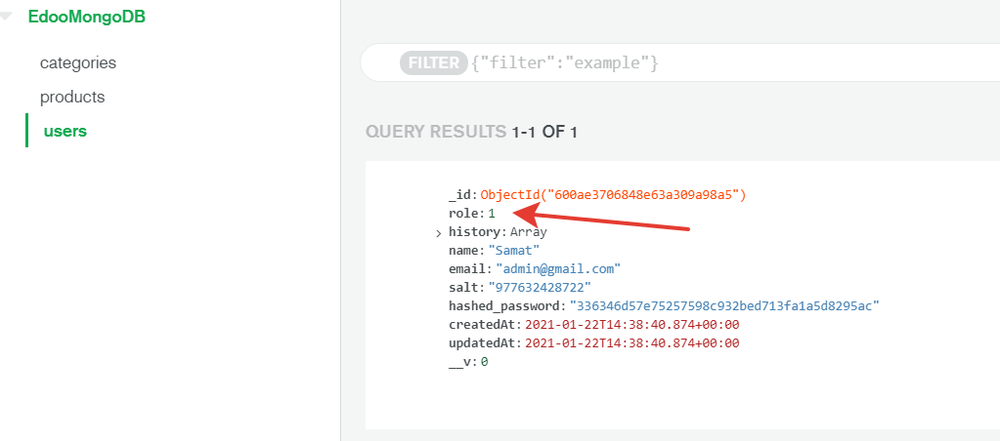

## OpenBook  - online education platform

[](https://edoo-daydone.herokuapp.com)

#### `Don't forget to put a star`

It is an MERN ( mongodb, express, react, node) stack edtech app. This app includes lots of functionality like pdfviewer, admin dashboard, create-book, create-subject, bag.

#### `Tech Stack:`

[](https://shields.io/)  [](https://shields.io/)  [](https://shields.io/)  [](https://shields.io/)
#### `ScreenShot:`




#### `.env structure`

```bash
MONGO_URI=<MONGO_DB_SERVER>
NODE_ENV=production
CLIENT_URL=<REACT_APP_SERVER>
PORT=8000
JWT=<JWT_SECRET>
```

#### `How to run locally?`
```bash
1. git clone https://github.com/samatzhusup/Edoo
2. cd Edoo-Platform
3. npm i
4. cd client 
5. npm i
6. cd ..
7. npm run dev
# project started
```
#### `MongoDB Structure`




#### `Deploying to Heroku will be soon)`
```
